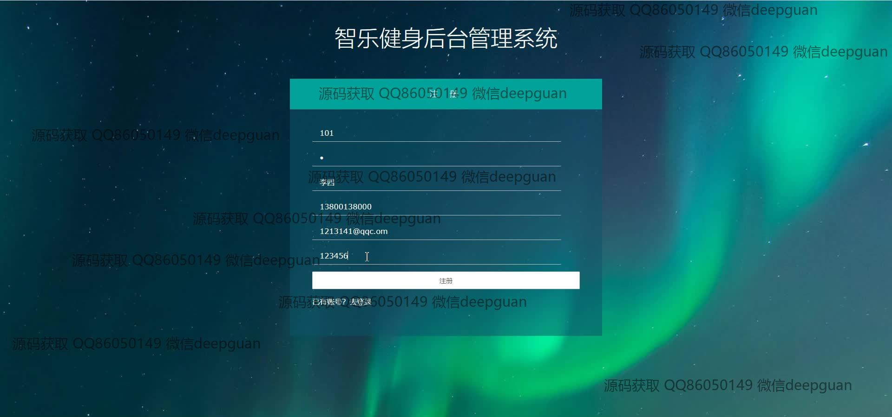
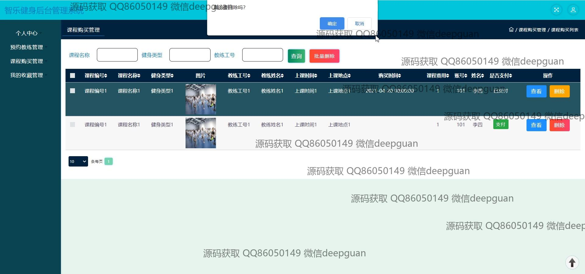
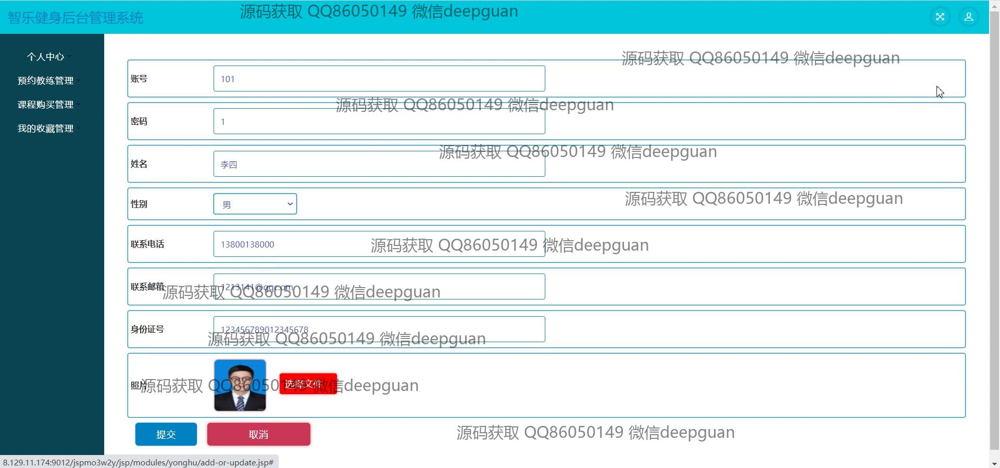

<h1 align="center">的智乐健身管理系统</h1>

## 简介
智乐健身管理系统：角色分为管理员、用户；功能包括健身课程管理、用户信息管理、订单处理、论坛互动、教练预约和后台管理，提升用户体验，促进健康生活方式。    --计算机毕业设计源码；毕设源码；java毕业设计源码

## 联系方式

<h3 align="center">获取完整代码与数据库文件 + 微信：deepguan QQ: 86050149 QQ群: 783742310</h3>

<h3 align="center">可帮忙远程部署 包运行成功！提供远程部署、修改代码、设计文档指导、代码讲解等服务！</h3>

## 功能介绍（完整见运行截图）
管理员： 登录管理系统后，管理员可以进行用户信息、健身教练信息和课程信息的管理。可以通过增删改查功能维护教练和课程的详细信息，如教练的个人资料、课程的时间、地点等。订单管理模块允许管理员查询和处理健身产品或服务订单。系统还提供文章编辑和发布、订单批量删除、以及健身知识内容管理的功能。

用户： 在登录后，用户可以浏览和搜索各种健身课程以及健身教练信息，并进行课程预约和购买。用户界面允许用户管理个人信息，包括更新联系信息和上传个人照片。用户还可以查看和管理订单状态、收货地址和个人收藏。论坛功能提供互动交流的平台，用户可以参与帖子发布和评论互动。通过个人中心，用户能够根据需求进行信息查询和管理，提升健身体验。

## 运行截图

本代码来源于网络,仅供学习参考使用!

